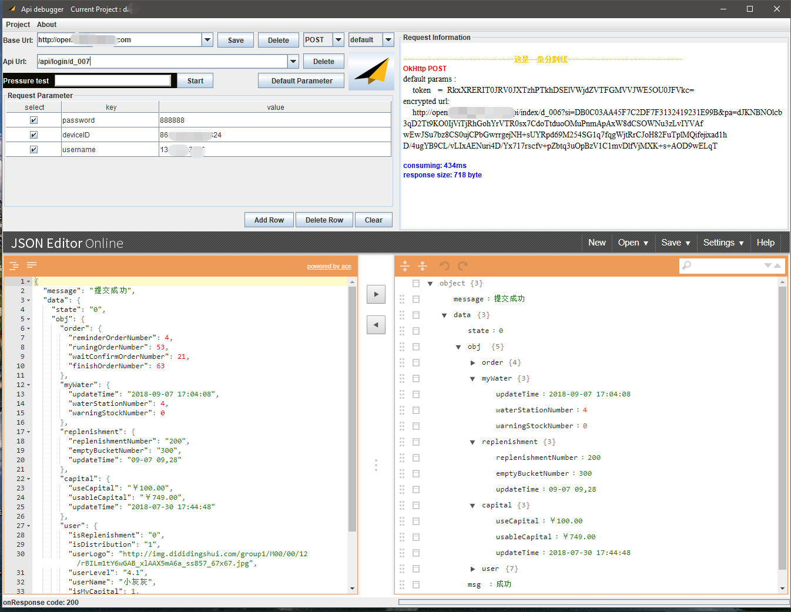

# API debugger

A like Postman API debugger that supports custom encryption.

一个类似Postman的支持自定义加密传输的后台API接口调试工具.



## 特征

-   支持可扩展的自定义的参数加密方式.
-   使用数据库按项目分开保存BaseUrl和接口Api列表,一次配置,持续使用.
-   支持多个BaseUrl点击切换.请求参数动态增删.
-   支持默认请求参数配置,该项目下的每一个接口请求都会默认添加默认请求参数.
-   使用[Json Editor Online](http://jsoneditoronline.org/)展示请求结果json,美观,易用.
-   支持简单的接口压力测试

## 安装

点击下载最新release包.在安装了JDK1.8或者JRE1.8的电脑上,双击jar包直接运行.

-   JDK下载地址:https://www.oracle.com/technetwork/java/javase/downloads/jdk8-downloads-2133151.html
-   如果在Windows系统下无法正常使用的话.需要安装 [Microsoft Visual C++ 2015 Redistributable (x64)](http://www.microsoft.com/en-us/download/details.aspx?id=53587)
-   默认支持mac和windows

## 使用

1.  创建项目:菜单栏 <kbd>Project</kbd> > <kbd>new</kbd>> <kbd>输入项目名称</kbd>><kbd>OK</kbd>

    

     看到当前打开的项目就OK了.

2.  输入BaseUrl,点击保存生效.

3.  输入接口Url,最后的请求Url = baseUrl+接口Url.

4.  选择请求方法,现在只做了POST和GET方法.

5.  选择加密方式.default是没有加密,直接发送.

6.  Add Row 添加一个请求参数.

7.  填写请求参数的key和value,这里需要注意的是需要表格失去焦点变为蓝色之后,这个值才会被保存生效.

    

8.  点击小飞机发送请求.请求的相关信息在右上部分的Request Information中显示.请求结果在下面的Json Editor中显示.

9.  请求成功返回后这个接口的url,方法,加密方式和请求参数会自动保存到数据库中.添加其他请求只需直接输入接口url和参数,方法等配置进行测试,前一个接口的信息不会被覆盖.

## 自定义加密扩展

该App界面使用Java实现,逻辑使用Kotlin实现.内部数据库为[ObjectBox](https://objectbox.io/),需要达到自定义加密的目的的话.需要自行扩展.

1.  **[重点]**fork仓库clone到本地后,使用IDEA打开.下载 jxbrowser-mac-6.20.jar (链接：https://pan.baidu.com/s/1B3ErPhbrocIaGhu3zg8RMA 密码：1wn9 )  拷贝到lib中(太大了不好传,虽然名字里有mac但是windows和mac都支持,linux尚未测试,如有linux使用需求,请自行查找linux版).

2.  在build生成out文件夹后,解压jsonView.rar到`\out\production\classes\com\longforus\apidebugger\ui`目录下(这样生成jar包的时候才会把这些文件包含到jar包中,gradle应该有别的更优雅的方法,目前尚未实现).

3.  实现`com.longforus.apidebugger.encrypt.IEncryptHandler`抽象类.可参考默认实现类`com.longforus.apidebugger.encrypt.DefaultEncryptHandler`

    ```kotlin
    /**
     * Created by XQ Yang on 8/30/2018  5:11 PM.
     * Description : 加密处理
     */
    abstract class IEncryptHandler {
        //这个加密类型的code,同一工程不允许出现相同的
        abstract val typeCode:Int
        //显示在界面上的名字
        abstract val title: String
        //实现get方法的参数加密
        abstract fun onGetMethodEncrypt(params: Map<String, String>?, builder: Request.Builder, url: String)
        //实现post方法的参数加密
        abstract fun onPostMethodEncrypt(params: Map<String, String>?, builder: Request.Builder, url: String): RequestBody
        override fun toString(): String {
            return title
        }
    }
    ```

4.  新建一个实现类的实例添加到`com.longforus.apidebugger.MyValueHandler#getEncryptImplList`中.第0个为默认显示item.现在就可以在加密方式中选择你自己的加密方式了.

    ```kotlin
    
    object MyValueHandler {
        val encryptImplList = listOf<IEncryptHandler>(YourEncryptHandler(), DefaultEncryptHandler())
       }
    ```

5.  打包可运行的jar包请自行搜索.

